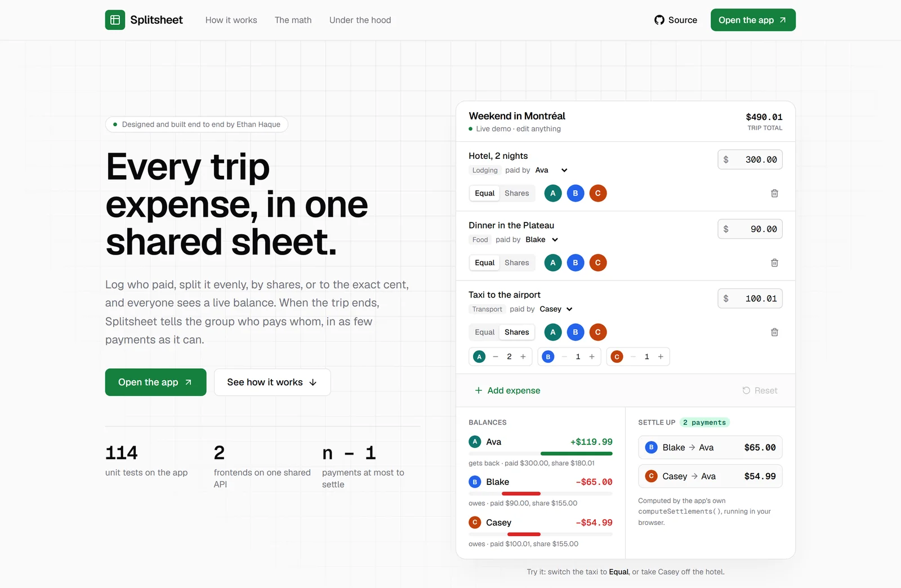

# splitsheet-site

The landing page for [Splitsheet](https://trip.ethanhaque.ca), a trip expense splitter with a spreadsheet-style ledger, live balances, and a settle-up plan. Its hero is a working demo: edit a three-person trip and watch the balances and settle-up payments recompute, using the **app's own money math**, in the browser, with no backend.



Built with Next.js 16 (App Router, static export), React 19, TypeScript `strict`, Tailwind v4, and Vitest.

## What's worth a look

- **The demo runs production code, not a mock.** `lib/expense-data.ts` and `lib/insights.ts` are copied unedited from [`splitsheet-web`](https://github.com/Ethan-Haque/splitsheet-web), with their test suites. `tools/verify-vendor.mjs` pins them by SHA-256 and CI fails if a copy is touched. See [ADR 0002](docs/adr/0002-vendor-the-money-math.md).
- **The opening numbers are asserted twice.** The demo trip is the same one `splitsheet-web`'s Playwright smoke test types into the deployed app. `test/demo.test.ts` pins the same balances (+$119.99 / −$65.00 / −$54.99) here, so the landing page and production can't quietly disagree.
- **The explanation can't drift from the code.** The "anatomy of a split" table re-derives the largest-remainder steps for display. A test sweeps amounts and weightings to check that those steps always land on the vendored `shareOf`.
- **It's honest about the algorithm.** The greedy settle-up plan isn't always minimal (the exact problem is NP-hard). The page shows the counterexample from the source's own doc comment next to the optimal plan, and the tests prove both plans clear the balances.
- **Almost everything is a Server Component.** Only the demo, the sheet tabs, and a single reveal-on-scroll IntersectionObserver ship JavaScript. The rest is static HTML rendered at build time, including the anatomy table and the Open Graph image, both computed by the vendored math.

## Page map

| Section | File |
| --- | --- |
| Nav, sticky | `components/sections/nav.tsx` |
| Hero + live splitter | `components/sections/hero.tsx`, `components/demo/live-splitter.tsx`, `lib/demo.ts` |
| Ledger showcase | `components/sections/showcase.tsx` |
| How it works (5 steps) | `components/sections/how-it-works.tsx` |
| Anatomy of a split, greedy vs. optimal | `components/sections/split-anatomy.tsx` |
| Feature grid | `components/sections/feature-gallery.tsx` |
| Maker note, CTA, footer | `components/sections/closing.tsx` |
| Sheet tabs, a floating dock that appears after the hero, ending in a "+ New trip" sign-up tab | `components/sections/sheet-tabs.tsx` |

Every outbound link and quoted figure lives in `lib/site.ts`.

## Scripts

```sh
npm install
npm run dev              # http://localhost:3000
npm run build            # static site in out/
npm start                # serve out/ locally
npm run lint
npm test                 # vendored suites + demo tests
npm run verify:vendor    # vendored files match their pinned digests
npm run verify:vendor -- --against ../trip-expense-splitter   # ...and the app's checkout
```

**Windows note:** where Application Control blocks the native SWC binaries, use `npm run dev -- --webpack` and `npm run build -- --webpack`. CI and Docker (Linux) use the default toolchain.

## Deployment

`next build` writes plain files to `out/`, and the `Dockerfile` serves them with nginx (see `nginx.conf` for caching and content types). On Coolify it runs as a Dockerfile app next to the product. There are no build variables: the one URL that varies, `SITE_URL`, is a constant in `lib/site.ts`. [ADR 0001](docs/adr/0001-static-export.md) explains why there's no Node server.

## Related repos

- [`splitsheet-web`](https://github.com/Ethan-Haque/splitsheet-web): the app (Next.js)
- [`splitsheet-api`](https://github.com/Ethan-Haque/splitsheet-api): Express 5 + PostgreSQL backend

## License

[MIT](./LICENSE)
